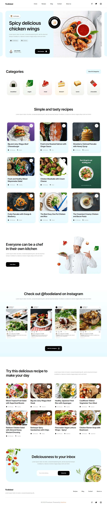

# foodieland-cooking-blog

Cooking blog and recipe site that stores users, posts, and recipes on a database and has its own API routes. Design is from figma comunity.

- [design](https://www.figma.com/community/file/1093372331682706566)

## Table of contents

- [Links](#links)
- [How to run](#how-to-run)
- [Built with](#built-with)
- [Screenshots](#screenshots)

## Links

- [home]()
    <!-- - [/recipes]()
        - [/6373f9f4061fefa272437741]()
    - [/blog]()
        - [/63753427f2a719d3998759c3]() -->
  - [not ready]()
    - [not ready]()
  - [not ready]()
    - [not ready]()
  - api
    - [/recipes](/api/recipes)
      - [/[id]](/api/recipes/6373f9f4061fefa272437741)
    - [/blogPosts](/api/blogPosts)
      - [/[id]](/api/blogPosts/63753427f2a719d3998759c3)
      - [/user/[id]](/api/blogPosts/user/6375174af2a719d3998759bd)
    - [/users](/api/users)
      - [/[id]](/api/users/6375174af2a719d3998759bd)

## How to run

```
// Use this command in client directory.
npm run dev
```

## Built with

- [Next.js](https://nextjs.org/)
- [MongoDB](https://www.mongodb.com/)
- [SASS](https://sass-lang.com/)
- [TailwindCSS](https://tailwindcss.com/)
- [TypeScript](https://www.typescriptlang.org/)

## Screenshots

### Home


